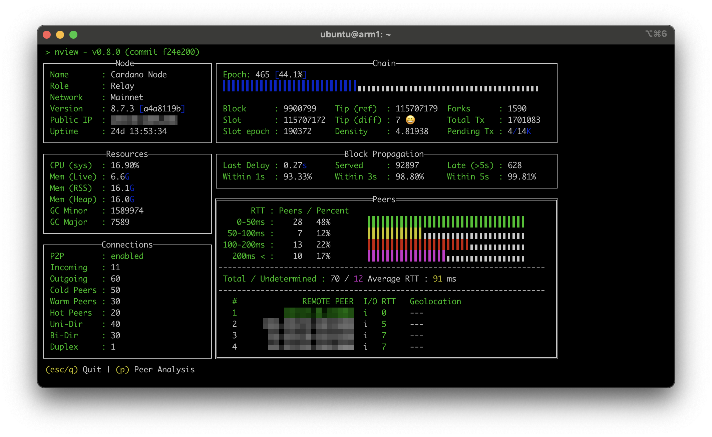

# nview

nview is a local monitoring tool for a Cardano Node (cardano-node) meant to
complement remote monitoring tools by providing a local view of a running
node from the command line. It's a TUI (terminal user interface) designed to
fit most screens.

<div align="center">
    
</div>

## Design and functionality

The goal with nview is to provide an alternative to the Guild LiveView
(gLiveView.sh) shell scripts which is shipped as a single binary with all of
the functionality included natively. This allows the tool to be more portable
to non-Linux systems by using Go standard library functionality.

The design is more in line with a 12-factor application, with no config
files or other on-disk requirements. Functionality is controlled via
environment variables within the application's context. This prevents the
application from being a drop-in replacement for gLiveView for Cardano Node
administrators, but unlocks the ability to add functionality beyond that
easily attainable with a shell script.

## Usage

Running nview against a running Cardano Node will work out of the box with a
default Cardano Node configuration, which exposes metrics in Prometheus data
format on a specific port.

```bash
./nview
```

Or, from source:
```bash
go run .
```

### Configuration

Configuration can be controlled by either a configuration file or environment
variables. In cases where both are present, the environment variable takes
precedence.

#### Configuration (env)

The following environment variables control the behavior of the application.

- `NODE_NAME` - Changes the name displayed by nview, default is "Cardano
  Node", maximum 19 characters
- `NETWORK` - Short-cut environment variable to use a default configuration
  for the given known named network. Overrides `CARDANO_NETWORK`, default ""
- `CARDANO_NETWORK` - Named network configured on the Cardano Node, default
  is "mainnet"
- `PROM_HOST` - Sets the host address used to fetch Prometheus metrics from a
  Cardano Node, default is "127.0.0.1"
- `PROM_PORT` - Sets the host port used to fetch Prometheus metrics from a
  Cardano Node, default is 12798
- `PROM_TIMEOUT` - Sets the maximum number of seconds to wait for response
  when polling a Cardano Node for Prometheus metrics, default is 3

#### Configuration (YAML)

To use a configuration file, run `nview` with a command line flag to set the
file to load as a configuration.

```bash
./nview -config /path/to/config.yml
```

config.yaml:
```
app:
  nodeName: Cardano Node
  network:
node:
  network: mainnet
  port: 3001
prometheus:
  host: 127.0.0.1
  port: 12798
  timeout: 3
```

An example configuration is provided at `config.yaml.example`.

## GeoLocation

We embed free GeoLite2 city data created by MaxMind, available
from https://www.maxmind.com and licensed under CC BY-SA 4.0
<https://creativecommons.org/licenses/by-sa/4.0/>
